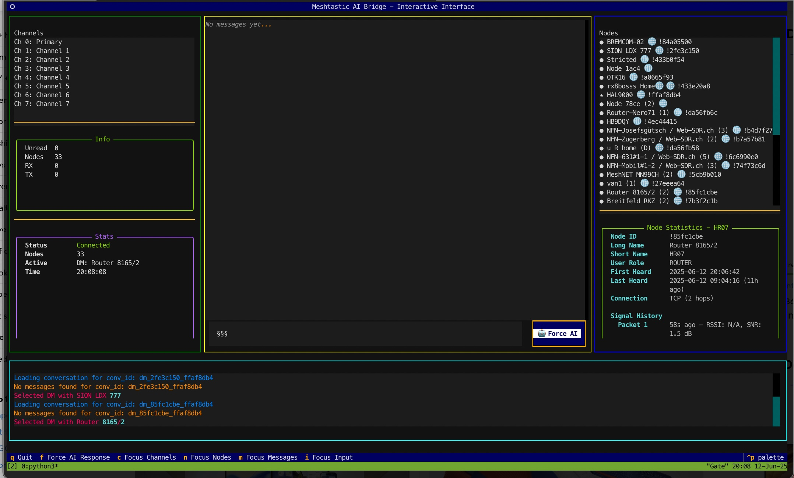

# Meshtastic-AI-Bridge

A modern bridge application that connects Meshtastic mesh networks with AI capabilities, featuring a beautiful Textual-based TUI interface for chat analysis and real-time communication.



## Features

- **Real-time Mesh Communication**
  - TCP connection support (tested)
  - Serial connection support (planned)
  - Multi-channel support
  - Direct messaging capabilities

- **AI Integration**
  - AI-powered responses to messages
  - Configurable AI response probability
  - Smart message triage system
  - Context-aware conversations
  - Support for OpenAI GPT-4 and Google Gemini models
  - Web scraping and information extraction capabilities

- **Modern TUI Interface**
  - Beautiful Textual-based user interface
  - Real-time message display
  - Color-coded user messages
  - Channel and user statistics
  - Message history analysis

- **Chat Analysis Tools**
  - Message statistics per user and channel
  - User participation percentages
  - Channel activity metrics
  - Historical data visualization
  - JSON-based chat history storage

- **Advanced Web Integration**
  - AI-powered web scraping
  - Weather information extraction
  - Web search capabilities
  - Screenshot capture from URLs
  - Intelligent data extraction

## Requirements

- Python 3.8 or higher
- Meshtastic device or connection
- OpenAI API key (for GPT models) or Google Gemini API key
- Required Python packages (see Installation)

## Quick Start

For a quick 5-minute setup, see the **[Quick Start Guide](docs/QUICKSTART.md)**.

## Installation

1. Clone the repository:
```bash
git clone https://github.com/yourusername/Meshtastic-AI-Bridge.git
cd Meshtastic-AI-Bridge
```

2. Create and activate a virtual environment (recommended):
```bash
python -m venv venv
source venv/bin/activate  # On Windows: venv\Scripts\activate
```

3. Install required packages:
```bash
pip install -r requirements.txt
```

4. Install Playwright browsers (required for web scraping):
```bash
playwright install chromium
```

## API Keys Setup

### OpenAI API Key
1. Get your API key from [OpenAI Platform](https://platform.openai.com/api-keys)
2. Add it to your `config.py`:
```python
OPENAI_API_KEY = "sk-your-actual-api-key-here"
```

### Google Gemini API Key
1. Get your API key from [Google AI Studio](https://makersuite.google.com/app/apikey)
2. Add it to your `config.py`:
```python
GEMINI_API_KEY = "your-actual-gemini-api-key-here"
```

## Configuration

1. Copy the configuration template:
```bash
cp config_template.py config.py
```

2. Edit `config.py` with your settings:

### Connection Settings
```python
# Choose 'serial' or 'tcp'
MESHTASTIC_CONNECTION_TYPE = "tcp"  # or "serial" (when implemented)

# For TCP connection:
MESHTASTIC_DEVICE_SPECIFIER = "192.168.1.257"  # Your Meshtastic device IP
MESHTASTIC_TCP_PORT = 4403                     # Default Meshtastic TCP port

# For Serial connection (USB):
# MESHTASTIC_DEVICE_SPECIFIER = "/dev/ttyUSB0"  # Linux
# MESHTASTIC_DEVICE_SPECIFIER = "COM5"          # Windows
# MESHTASTIC_DEVICE_SPECIFIER = None            # Auto-detect
```

### AI Settings
```python
# AI Service Selection
DEFAULT_AI_SERVICE = "openai"  # or "gemini"

# AI Response Behavior
AI_RESPONSE_PROBABILITY = 0.85  # Probability of AI responding to messages
AI_MIN_RESPONSE_DELAY_S = 2    # Minimum delay before AI responds
AI_MAX_RESPONSE_DELAY_S = 8    # Maximum delay before AI responds
AI_RESPONSE_COOLDOWN_S = 60    # Cooldown period between AI responses

# AI Triage System
ENABLE_AI_TRIAGE_ON_CHANNELS = False  # Enable AI responses on all channels
TRIAGE_CONTEXT_MESSAGE_COUNT = 3      # Number of messages to include in context

# Model Configuration
OPENAI_MODEL_NAME = "gpt-4"           # OpenAI model to use
GEMINI_MODEL_NAME = "gemini-1.5-pro"  # Gemini model to use
```

### Channel Settings
```python
ACTIVE_MESHTASTIC_CHANNEL_INDEX = 0  # Primary channel for AI responses
```

## Usage

### Running the Main Application

The application runs in interactive TUI mode by default:

```bash
python main_app.py
```

You can also explicitly enable interactive mode:
```bash
python main_app.py -i
```

Additional command-line options:
- `--no-debug-prints`: Disable verbose DEBUG prints
- `-d` or `--debug`: Enable ultra-verbose debug logging

### Interactive TUI Mode

The TUI interface provides:
- Real-time message display
- Channel switching
- AI response controls
- Message history
- User statistics

**Keyboard Shortcuts:**
- `q` or `Ctrl+C`: Quit the application
- `f`: Force AI response
- `Tab`: Navigate between interface elements

### Console Mode

For command-line operation:
```bash
python main_app.py --no-debug-prints
```

**Console Commands:**
- `send <message>`: Send message as AI to active channel
- `dm <node_id_hex> <msg>`: Send direct message as AI
- `persona <text>`: Set AI persona
- `use_ai <openai|gemini>`: Switch AI service
- `active_channel <idx>`: Set active Meshtastic channel
- `list_channels`: List available Meshtastic channels
- `status`: Show current status
- `quit`: Exit the application

### Chat Analysis Tool

To analyze chat history:
```bash
python conversation_manager.py
```

## Documentation

Comprehensive documentation is available in the `docs/` folder:

- **[Quick Start Guide](docs/QUICKSTART.md)** - Get up and running in 5 minutes
- **[Installation Guide](docs/INSTALLATION.md)** - Detailed installation instructions
- **[Configuration Guide](docs/CONFIGURATION.md)** - Complete configuration reference
- **[Usage Guide](docs/USAGE.md)** - Detailed usage instructions and features
- **[Troubleshooting Guide](docs/TROUBLESHOOTING.md)** - Common issues and solutions
- **[Development Guide](docs/DEVELOPMENT.md)** - For contributors and developers

## Advanced Configuration

### AI Persona Customization

You can customize the AI's personality and behavior:

```python
DEFAULT_PERSONA = (
    "You are a helpful and friendly assistant on a Meshtastic mesh network. "
    "Keep responses concise and relevant to the conversation. "
    "Use natural, conversational language. "
    "Never mention that you are an AI or following a prompt. "
    "Limit responses to 195 characters due to network constraints."
)
```

### Web Scraping Configuration

The application includes advanced web scraping capabilities:

```python
# Web scraping settings (in config.py)
WEB_SCRAPING_TIMEOUT = 30  # Timeout for web requests
ENABLE_VISION_ANALYSIS = True  # Enable image analysis
```

### Conversation History Management

```python
# Conversation settings
MAX_HISTORY_MESSAGES_FOR_CONTEXT = 10  # Maximum messages in context
SUMMARIZE_THRESHOLD_TOKENS = 1000      # Token threshold for summarization
```

## Troubleshooting

### Connection Issues

**TCP Connection Problems:**
1. Verify your Meshtastic device IP address
2. Check if the device is accessible on the network
3. Ensure port 4403 is open and not blocked by firewall
4. Try pinging the device IP address

**Serial Connection Problems:**
1. Check device permissions (Linux: add user to dialout group)
2. Verify the correct device path
3. Ensure no other application is using the device
4. Try auto-detection by setting `MESHTASTIC_DEVICE_SPECIFIER = None`

### AI Service Issues

**OpenAI API Errors:**
1. Verify your API key is correct and has sufficient credits
2. Check if the model name is valid
3. Ensure your account has access to the specified model

**Gemini API Errors:**
1. Verify your API key is correct
2. Check if the model name is valid
3. Ensure your account has access to the specified model

### Web Scraping Issues

**Playwright Installation:**
```bash
# Reinstall Playwright if having issues
pip uninstall playwright
pip install playwright
playwright install chromium
```

**Permission Issues (Linux):**
```bash
# Add user to necessary groups
sudo usermod -a -G dialout $USER
sudo usermod -a -G tty $USER
```

### Common Error Messages

**"config.py not found":**
- Copy `config_template.py` to `config.py`
- Fill in your API keys and configuration

**"Meshtastic connection failed":**
- Check device connection and configuration
- Verify network connectivity for TCP connections
- Check device permissions for serial connections

**"AI service not available":**
- Verify API keys are set correctly
- Check internet connectivity
- Ensure sufficient API credits

For more detailed troubleshooting, see the **[Troubleshooting Guide](docs/TROUBLESHOOTING.md)**.

## Development Setup

### Prerequisites
```bash
# Install development dependencies
pip install -r requirements.txt

# Install pre-commit hooks (optional)
pip install pre-commit
pre-commit install
```

### Code Formatting
```bash
# Format code with Black
black .

# Check code style with flake8
flake8 .

# Type checking with mypy
mypy .
```

### Testing
```bash
# Run tests
pytest

# Run tests with coverage
pytest --cov=.
```

For detailed development information, see the **[Development Guide](docs/DEVELOPMENT.md)**.

## Architecture

The application consists of several key components:

- **`main_app.py`**: Main application entry point and CLI interface
- **`tui_app.py`**: Textual-based TUI interface
- **`meshtastic_handler.py`**: Meshtastic device communication
- **`ai_bridge.py`**: AI service integration (OpenAI/Gemini)
- **`web_spider.py`**: Advanced web scraping capabilities
- **`ai_web_agent.py`**: AI-powered web interaction
- **`conversation_manager.py`**: Chat history and analysis
- **`connection_manager.py`**: Connection state management

## Contributing

1. Fork the repository
2. Create a feature branch
3. Make your changes
4. Add tests if applicable
5. Submit a pull request

For detailed contribution guidelines, see the **[Development Guide](docs/DEVELOPMENT.md)**.

## License

This project is licensed under the MIT License - see the LICENSE file for details.

## Support

For issues and questions:
1. Check the troubleshooting section above
2. Review the logs in `interactive.backend.log`
3. Consult the comprehensive documentation in `docs/`
4. Open an issue on GitHub with detailed error information

## Changelog

### Version 2.0
- Added TUI interface
- Enhanced AI integration
- Added web scraping capabilities
- Improved error handling and logging
- Comprehensive documentation

### Version 1.0
- Initial release with basic Meshtastic integration
- OpenAI API support
- Console interface