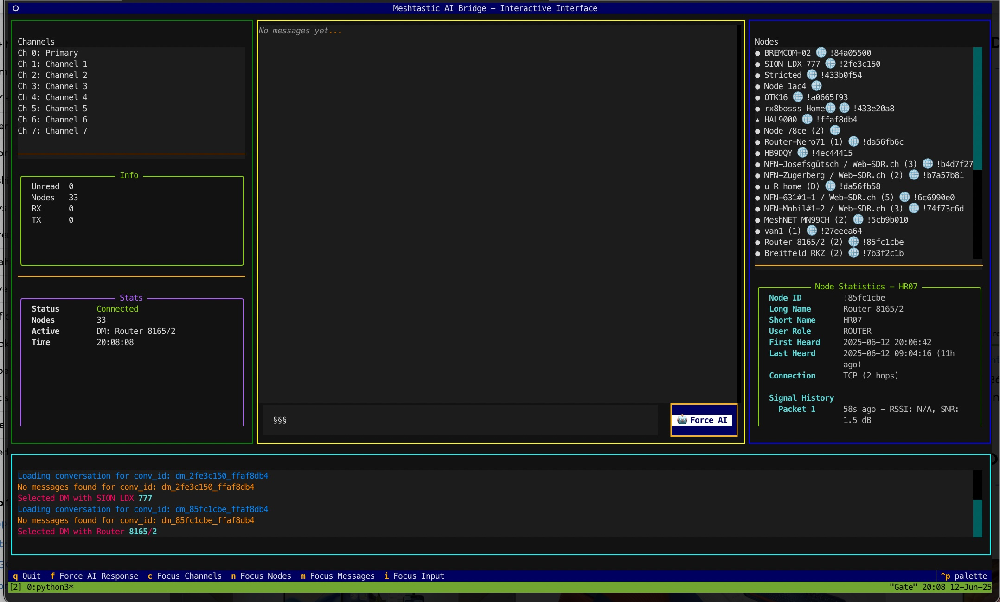
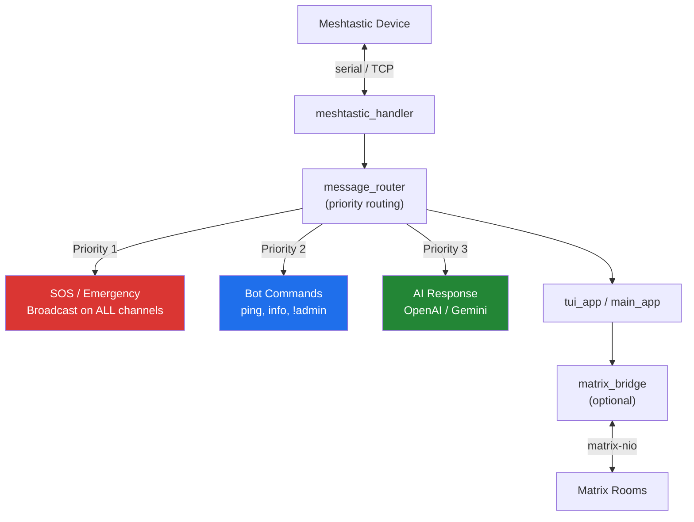

# Meshtastic-AI-Bridge

Hey there! Welcome to Meshtastic-AI-Bridge - your friendly bridge between Meshtastic mesh networks and AI capabilities. Think of it as giving your mesh network a smart, helpful assistant that can chat, answer questions, broadcast emergency alerts, and even browse the web for you!



## What Can It Do?

### Real-time Mesh Communication
- **TCP & Serial Connections**: Works with your existing Meshtastic setup
- **Multi-channel Support**: Chat across different channels
- **Direct Messaging**: Send private messages to specific nodes
- **Smart Message Routing**: Central routing engine with priority-based handling

### AI-Powered Conversations
- **Smart Responses**: AI that actually understands context and responds naturally
- **Configurable Personality**: Make it as chatty or reserved as you want
- **Smart Triage**: Only responds when it makes sense (no spam!)
- **Context Awareness**: Remembers what you've been talking about
- **Multiple AI Services**: Choose between OpenAI's GPT or Google's Gemini
- **Web Integration**: Can look up weather, search the web, and analyze websites

### SOS / Emergency Broadcasting
- **Help Keywords**: Detects multilingual emergency words (SOS, help, mayday, pomoc, ratunku, hilfe, emergency...)
- **Multi-channel Broadcast**: Automatically re-broadcasts emergency alerts across ALL mesh channels
- **Instant Response**: SOS messages bypass normal routing and get top priority

### Remote Admin Commands
Manage the bot remotely over the mesh network (authorized nodes only):
- `!admin status` - Bot status (node ID, connection, AI service, uptime)
- `!admin nodes` - List connected mesh nodes
- `!admin channels` - List active channels
- `!admin persona <text>` - Change AI personality on-the-fly
- `!admin switch_ai <openai|gemini>` - Switch AI service remotely

### Beautiful User Interface
- **Modern TUI**: Clean, intuitive interface (Textual framework)
- **Real-time Updates**: See messages as they happen
- **Color-coded Messages**: Easy to distinguish between users
- **Channel Management**: Switch between channels effortlessly
- **Statistics**: See who's most active and what's happening

### Matrix Bridge
- **Mesh-to-Matrix Forwarding**: All mesh channel messages appear in dedicated Matrix rooms
- **Per-Node DM Rooms**: Each mesh node gets its own Matrix DM room
- **Bidirectional**: Reply from Matrix and your message goes back to the mesh
- **Auto-Room Creation**: Rooms created automatically for each channel and DM node
- **Auto-Invite**: Configurable user auto-invite to all bridge rooms

### Chat Analysis & Insights
- **Message Statistics**: Track activity patterns
- **User Participation**: See who's contributing most
- **Channel Analytics**: Understand your network's activity
- **Historical Data**: Keep track of conversations over time
- **JSON Storage**: Easy to export and analyze data

## What You'll Need

- **Python 3.10+**
- **A Meshtastic Device**: Any compatible device (T-Beam, Heltec, etc.)
- **API Keys**: Either OpenAI or Google Gemini
- **Internet Connection**: For AI services and web features
- **Matrix Account** *(optional)*: For bridging to Matrix (e.g. Element, FluffyChat)

## Quick Start

### Step 1: Get the Code
```bash
git clone https://github.com/dzaczek/Meshtastic-AI-Bridge.git
cd Meshtastic-AI-Bridge
```

### Step 2: Set Up Your Environment
```bash
python3 -m venv .venv
source .venv/bin/activate  # On Windows: .venv\Scripts\activate

pip install -r requirements.txt

# Install web browser support (for web features)
playwright install chromium
```

### Step 3: Configure Secrets
```bash
cp .env.template .env
```
Edit `.env` and fill in your API keys:
```env
OPENAI_API_KEY=sk-your-key-here
GEMINI_API_KEY=your-gemini-key-here
MESHTASTIC_CONNECTION_TYPE=serial    # or "tcp"
MESHTASTIC_DEVICE_SPECIFIER=         # e.g. /dev/ttyUSB0 or 192.168.1.100
DEFAULT_AI_SERVICE=openai            # or "gemini"

# Matrix Bridge (optional)
MATRIX_ENABLED=false
MATRIX_HOMESERVER=https://matrix.org
MATRIX_USERNAME=@your-bot:matrix.org
MATRIX_PASSWORD=your-bot-password
MATRIX_INVITE_USERS=@your-account:matrix.org
```

### Step 4: Configure the Bot
```bash
cp config_template.py config.py
```
Edit `config.py` to customize behavior, persona, admin nodes, etc.

## Getting Your API Keys

### OpenAI API Key
1. Head over to [OpenAI Platform](https://platform.openai.com/api-keys)
2. Sign in or create an account
3. Click "Create new secret key"
4. Copy the key (starts with `sk-`)

### Google Gemini API Key
1. Visit [Google AI Studio](https://makersuite.google.com/app/apikey)
2. Sign in with your Google account
3. Click "Create API Key"

## Configuration

### Connection Settings
```python
MESHTASTIC_CONNECTION_TYPE = "tcp"      # or "serial"
MESHTASTIC_DEVICE_SPECIFIER = "192.168.1.100"
```

### AI Settings
```python
DEFAULT_AI_SERVICE = "openai"       # or "gemini"
AI_RESPONSE_PROBABILITY = 0.85     # 0.0 = silent, 1.0 = always responds
AI_MIN_RESPONSE_DELAY_S = 2
AI_MAX_RESPONSE_DELAY_S = 8
AI_RESPONSE_COOLDOWN_S = 60
OPENAI_MODEL_NAME = "gpt-4o"
GEMINI_MODEL_NAME = "gemini-1.5-pro"
```

### Admin Settings
```python
# Node IDs authorized for !admin commands (hex, lowercase, no '!' prefix)
ADMIN_NODE_IDS = ["a1b2c3d4", "e5f6a7b8"]
```

### AI Persona
```python
DEFAULT_PERSONA = (
    "You are a helpful and friendly assistant on a Meshtastic mesh network. "
    "Keep responses concise and relevant. "
    "Limit responses to 195 characters due to network constraints."
)
```

## Running Your Bridge

### The Easy Way (Recommended)
```bash
python main_app.py
```
This starts the TUI interface.

### Other Options
```bash
python main_app.py -i          # Explicitly start TUI mode
python main_app.py --no-debug  # Console mode
python main_app.py -d          # Debug mode
```

## Using Your AI Bridge

### TUI Mode
- **Real-time Messages**: See everything as it happens
- **Easy Navigation**: Use Tab to move around
- **Quick Actions**: Press 'f' to force an AI response
- **Channel Switching**: Click to switch between channels

**Keyboard Shortcuts:**
- `q` or `Ctrl+C`: Exit
- `f`: Force AI to respond
- `Tab`: Navigate around
- `Enter`: Send messages
- `F9`: Toggle mesh map
- `F10`: Cycle map node filter
- `+`/`-`: Map zoom in/out
- `0`: Reset map zoom

### Console Mode
```bash
send Hello everyone!          # Send a message as AI
dm a1b2c3d4 Private message   # Send private message
use_ai gemini                 # Switch to Gemini
status                        # Check what's happening
quit                          # Exit
```

## Project Structure

```
Meshtastic-AI-Bridge/
├── main_app.py              # Main entry point
├── tui_app.py               # TUI interface (Textual)
├── message_router.py        # Central message routing engine
├── hal_bot.py               # Bot commands + admin commands
├── meshtastic_handler.py    # Meshtastic device communication
├── ai_bridge.py             # AI service integration (OpenAI, Gemini)
├── web_agent.py             # Unified web agent (search, weather, scraping)
├── conversation_manager.py  # Chat history management (JSON)
├── connection_manager.py    # Connection state machine
├── config.py                # Bot configuration (git-ignored)
├── matrix_bridge.py         # Matrix protocol bridge (mesh <-> Matrix rooms)
├── mesh_map.py              # OSM tile map rendering for TUI
├── config_template.py       # Configuration template
├── .env                     # API keys & secrets (git-ignored)
├── .env.template            # Secrets template
└── docs/                    # Documentation
```

### Architecture


```mermaid
graph TD
    MESH["Meshtastic Device"] <-->|"serial / TCP"| MH["meshtastic_handler"]
    MH --> MR["message_router<br/>(priority routing)"]

    MR -->|"Priority 1"| SOS["SOS / Emergency<br/>Broadcast on ALL channels"]
    MR -->|"Priority 2"| BOT["Bot Commands<br/>ping, info, !admin"]
    MR -->|"Priority 3"| AI["AI Response<br/>OpenAI / Gemini"]

    MR --> UI["tui_app / main_app"]
    UI --> MB["matrix_bridge<br/>(optional)"]
    MB <-->|"matrix-nio"| MAT["Matrix Rooms"]

    style SOS fill:#da3633,color:#fff
    style BOT fill:#1f6feb,color:#fff
    style AI fill:#238636,color:#fff
```

**Routing priorities:**
1. **SOS/Emergency** - Keyword detection, broadcasts on all channels
2. **Bot Commands** - `!bot` commands + `!admin` commands
3. **AI Response** - Context-aware AI with web capabilities

> See **[Architecture & Message Flows](docs/ARCHITECTURE.md)** for detailed Mermaid diagrams of every subsystem.

## Documentation

- **[Architecture & Flows](docs/ARCHITECTURE.md)** - Mermaid diagrams of all message flows and subsystems
- **[Quick Start](docs/QUICKSTART.md)** - Get running in 5 minutes
- **[Installation](docs/INSTALLATION.md)** - Detailed setup instructions
- **[Configuration](docs/CONFIGURATION.md)** - All settings explained
- **[Usage](docs/USAGE.md)** - How to use all features
- **[Troubleshooting](docs/TROUBLESHOOTING.md)** - Fix common issues
- **[Development](docs/DEVELOPMENT.md)** - For contributors

## Troubleshooting

### Connection Issues
**"Can't connect to my device"**
1. Check your device's IP address
2. Make sure it's on the same network
3. Try pinging the IP address
4. Check if port 4403 is open

**"Permission denied" (Linux users)**
```bash
sudo usermod -a -G dialout $USER
sudo usermod -a -G tty $USER
# Then log out and back in
```

### AI Service Issues
**"API key not working"**
1. Make sure your `.env` file has the correct key
2. Check if you have credits/quotas
3. Verify the key format (OpenAI keys start with `sk-`)

### Web Scraping Issues
**"Playwright not working"**
```bash
pip install playwright
playwright install chromium
```

## Contributing

1. Fork the repository
2. Create a feature branch
3. Make your changes
4. Submit a pull request

Check out the **[Development Guide](docs/DEVELOPMENT.md)** for details.

## License

This project is open source under the MIT License.

## What's New?

### Version 6.0 (Latest)
- **Matrix Bridge** - Bidirectional bridge to Matrix protocol with per-channel and per-node DM rooms
- **Mesh Map** - OSM tile map in TUI with zoom, node filtering, and half-block Unicode rendering
- **Bot Rename** - Command prefix changed from `!hal` to `!bot`
- **AI Model Update** - Default model updated to `gpt-4o` for better response quality

### Version 5.9
- **Message Router** - Central routing engine replacing duplicated logic in CLI/TUI
- **SOS/Emergency Broadcast** - Multilingual help keyword detection with multi-channel broadcast
- **Admin Commands** - Remote bot management via mesh (`!admin status/nodes/persona/switch_ai`)
- **Unified Web Agent** - Merged web_spider + ai_web_agent into single `web_agent.py`
- **Secrets Management** - API keys moved to `.env` file (python-dotenv)
- **Code Reduction** - ~300 lines of duplicated code removed

### Version 5.8
- Enhanced performance and stability
- Improved error handling and recovery
- Better web scraping capabilities
- Enhanced AI response quality
- Improved TUI interface responsiveness

### Version 2.0
- Beautiful TUI interface
- Enhanced AI integration
- Web scraping capabilities
- Comprehensive documentation

### Version 1.0
- Basic Meshtastic integration
- OpenAI API support
- Console interface

---

**Happy meshing!**

Your AI assistant is ready to make your mesh network conversations more engaging and helpful.
