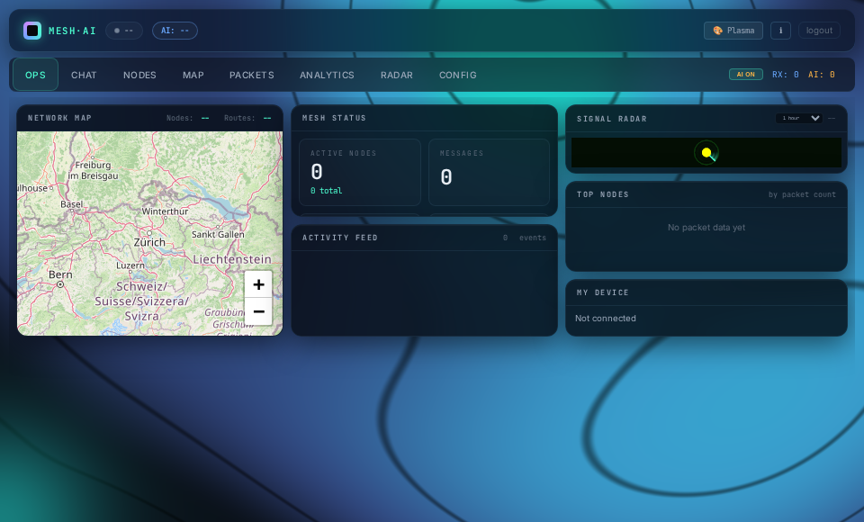
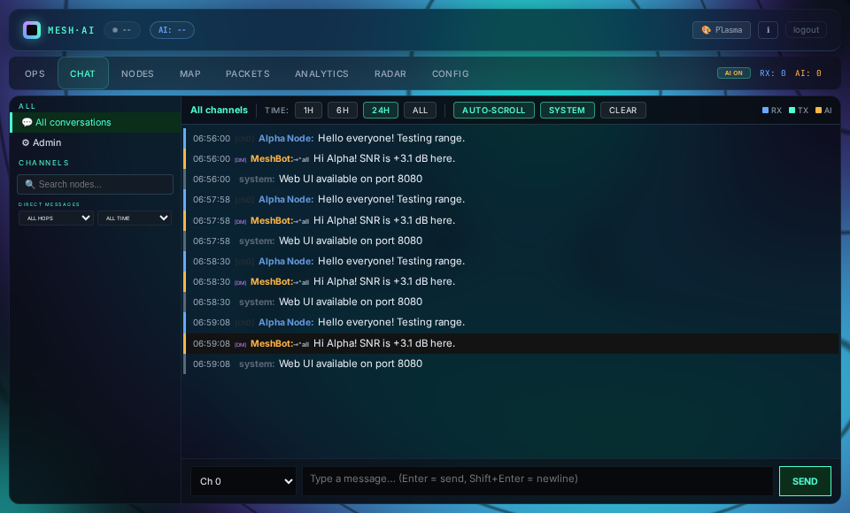
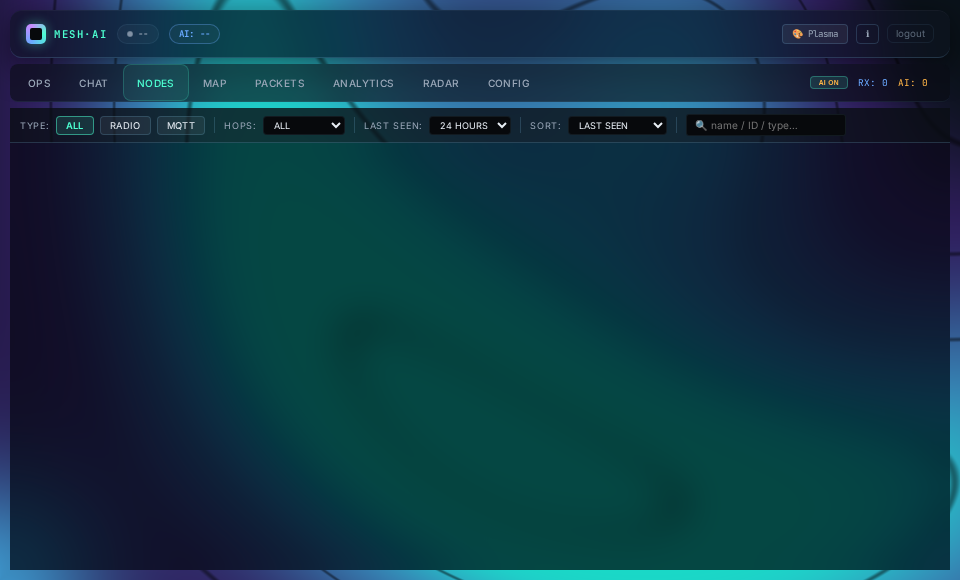
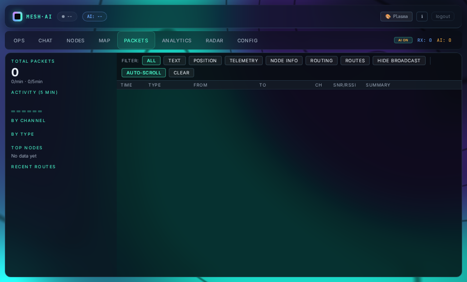
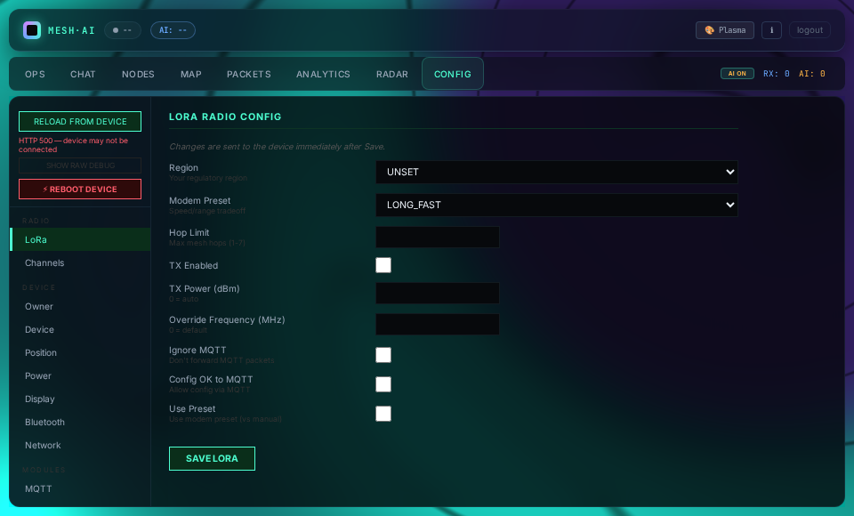
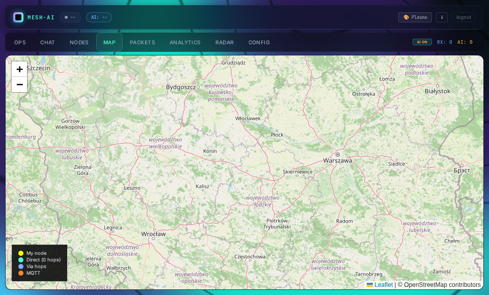

# Meshtastic AI Bridge

[](https://buymeacoffee.com/dzaczek)

> AI-powered gateway between Meshtastic LoRa mesh networks, AI assistants, a web dashboard, and Matrix messenger — runs as a Docker container, no terminal required.

## Overview
This system provides a full-featured web dashboard to monitor and manage a Meshtastic LoRa network. It bridges communication with AI assistants (like OpenAI or Gemini) and Matrix messenger, enabling advanced conversational interfaces right on the mesh.


*The OPS dashboard provides a SOC-style overview of your mesh network. You can view top-nodes by signal strength, watch a live activity feed of all messages, and monitor your connection status in real-time.*

### Demo
Watch a complete walkthrough of the dashboard showcasing the interactive Map, Node details, Packet feed, Chat interface, and system configuration:
[Watch the system in action](./mdfiles/demo.webm)

---

## Tabs at a glance

| | |
|---|---|
|  |  |
| **Chat** — Engage in per-channel and per-node (DM) conversation threads. It features delivery ACK indicators (pending, delivered, failed) and clickable sender names that open detailed node profiles. History persists across restarts. | **Nodes** — View live node cards displaying SNR/RSSI, battery levels, GPS coordinates, and hop count. The detail panel includes signal/telemetry charts, a position trail on a mini-map, and traceroute history. |
|  |  |
| **Packets** — Monitor a Wireshark-style feed of raw packets with a real-time stats panel. Includes per-channel/type breakdowns, route tracing, and an auto-scroll toggle for continuous monitoring. | **Config** — Perform full hardware configuration via the Meshtastic API. Easily adjust LoRa region/preset, device role, position, network settings, and execute a one-click device reboot. |
|  | |
| **Map** — Explore a Leaflet.js interactive map featuring node markers color-coded by type and traceroute polylines visualizing intermediate hops. | |

---

## Features

### Web Dashboard (port 8080)
- **OPS** — SOC-style overview: live map, activity feed, top-nodes leaderboard, connection status bar
- **Chat** — per-channel and per-node (DM) conversation threads; clickable sender names open node details; unread badges; ACK indicators (⋯ pending / ✓ delivered / ✗ failed); system-message hide toggle; history persists across restarts
- **Nodes** — node cards with SNR/RSSI, battery, GPS, hops, freshness colours; detail panel with signal/telemetry charts, position trail on mini-map, message history, traceroute history
- **Map** — Leaflet.js interactive map, node markers colour-coded by type, traceroute polyline through all intermediate hops
- **Packets** — stats panel (left) + live feed (right); per-channel/type breakdown; route tracing; auto-scroll toggle
- **Radar** — canvas sweep animation, GPS or SNR-based positioning, age/hops/SNR filters
- **Config** — read and write full device configuration: LoRa region/preset, Device role, Position (including fixed/virtual GPS), Power, Network/WiFi, Display, Bluetooth, Channels, MQTT, Telemetry intervals; one-click device reboot

### AI & Bot
- **OpenAI GPT / Google Gemini** — context-aware responses, configurable persona, smart triage
- **SOS detection** — multilingual emergency keyword detection, broadcasts on all channels
- **HAL bot** — auto-responds to ping and traceroute requests; remote `!admin` commands
- **Web search** — AI can fetch live data from the internet during a conversation
- **Traceroute** — trigger from node detail panel; result visualised as map polyline + hop diagram + SNR table; history stored per device in SQLite

### Matrix Bridge
- **Bidirectional** — mesh messages forwarded to Matrix rooms; Matrix replies delivered to the mesh
- **Per-channel rooms** — each Meshtastic channel gets its own Matrix room (auto-created)
- **Per-node DM rooms** — direct messages get dedicated rooms
- **Error notifications** — crashes and reconnect events reported to a dedicated Matrix room

### Persistent Storage
- **SQLite WAL** — signal history, GPS tracks, telemetry, messages and traceroutes per node; survives device reboots and bridge restarts

---

## Quick Start

### Prerequisites
- Docker + Docker Compose
- Meshtastic device reachable via **TCP** (recommended) or USB serial
- OpenAI or Gemini API key

### 1 — Clone and configure

```bash
git clone https://github.com/dzaczek/Meshtastic-AI-Bridge.git
cd Meshtastic-AI-Bridge
cp config_template.py config.py
cp .env.template .env
```

Edit `config.py` — minimal required settings:

```python
MESHTASTIC_CONNECTION_TYPE  = "tcp"
MESHTASTIC_DEVICE_SPECIFIER = "192.168.1.x"   # your Meshtastic node IP
DEFAULT_AI_SERVICE          = "openai"
OPENAI_API_KEY = os.environ.get("OPENAI_API_KEY", "")
```

Edit `.env`:

```env
OPENAI_API_KEY=sk-...
WEB_UI_USERNAME=admin
WEB_UI_PASSWORD=your_dashboard_password
WEB_UI_SECRET_KEY=<64 random hex chars>   # generate: openssl rand -hex 32

# Matrix bridge (optional)
MATRIX_ENABLED=false
MATRIX_HOMESERVER=https://matrix.example.org
MATRIX_USERNAME=@meshbot:example.org
MATRIX_PASSWORD=your_matrix_bot_password
MATRIX_INVITE_USERS=@you:example.org

# Error reporter (optional — can be same bot as above)
ERROR_MATRIX_HOMESERVER=https://matrix.example.org
ERROR_MATRIX_USERNAME=@meshbot:example.org
ERROR_MATRIX_PASSWORD=your_matrix_bot_password
ERROR_MATRIX_ROOM_ID=!roomid:example.org
```

### 2 — Start

```bash
docker compose up -d
```

Dashboard → `http://<server-ip>:8080`

The container restarts automatically on server reboot (`restart: unless-stopped`).

### 3 — Update

```bash
git fetch --all
git reset --hard origin/main
docker compose up -d --build
```

---

## Architecture

```
Meshtastic device  (TCP / USB serial)
        │
MeshtasticHandler  (pubsub events, config r/w, traceroute, fixed GPS)
        │
    ┌───┴──────────────────────────────┐
    │                                  │
main_app.py                      MatrixBridge
 ├─ MessageRouter                    (matrix-nio, bidirectional)
 │   ├─ HalBot  (ping / traceroute)
 │   └─ AIBridge  (OpenAI / Gemini)
 ├─ web_ui.py  (Flask REST + Jinja2 dashboard)
 ├─ node_db.py  (SQLite WAL — signal/GPS/telemetry/messages/traceroutes)
 └─ error_reporter.py  (Matrix HTTP crash alerts)
```

---

## Docker Volumes

| Host path | Container | Purpose |
|---|---|---|
| `./config.py` | `/app/config.py` (ro) | Bot configuration |
| `./.env` | env_file | Secrets / API keys |
| `./data/` | `/app/data/` | SQLite node database + chat history |
| `./conversations/` | `/app/conversations/` | Legacy message store |
| `./logs/` | `/app/logs/` | Application logs |

---

## Key Config Variables

| Variable | Default | Description |
|---|---|---|
| `MESHTASTIC_CONNECTION_TYPE` | `tcp` | `tcp` or `serial` |
| `MESHTASTIC_DEVICE_SPECIFIER` | — | IP address or `/dev/ttyUSBx` |
| `DEFAULT_AI_SERVICE` | `openai` | `openai` or `gemini` |
| `ACTIVE_MESHTASTIC_CHANNEL_INDEX` | `0` | Channel the AI posts on |
| `MATRIX_ENABLED` | `False` | Enable Matrix bridge |
| `MATRIX_ROOM_PREFIX` | `mesh` | Room alias prefix (`#mesh-ch0:server`) |
| `MATRIX_INVITE_USERS` | — | Comma-separated Matrix IDs to auto-invite |
| `WEB_UI_PORT` | `8080` | Dashboard listen port |
| `WEB_UI_SECRET_KEY` | — | Flask session secret (set a long random string) |

Full reference: [docs/CONFIGURATION.md](docs/CONFIGURATION.md)

---

## Remote Admin Commands

Send from any authorised mesh node:

| Command | Description |
|---|---|
| `!admin status` | Bot status (node ID, AI service, uptime) |
| `!admin nodes` | List visible mesh nodes |
| `!admin channels` | List configured channels |
| `!admin persona <text>` | Change AI personality |
| `!admin switch_ai openai\|gemini` | Switch AI service live |

---

## Requirements

- Python 3.11 (Docker image `python:3.11-slim`)
- `meshtastic >= 2.0`
- `flask >= 3.0`, `werkzeug >= 3.0`
- `matrix-nio` (Matrix bridge)
- `requests` (error reporter)

Full list: [`requirements.txt`](requirements.txt)
