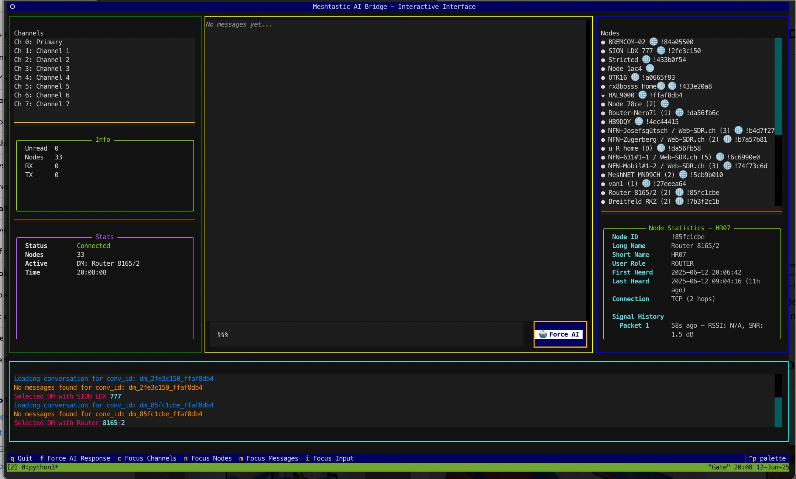

# Meshtastic AI Bridge

An AI-powered service that bridges Meshtastic LoRa mesh networks with AI assistants, a web dashboard, and Matrix messenger. Runs as a Docker container with automatic restart — no terminal required.

> **TUI removed** — the Textual terminal interface was impractical for server deployments and has been replaced with a full web-based dashboard accessible from any browser on the local network.



## Features

### Web Dashboard (port 8080)
- **Chat** — per-channel and per-node (DM) conversation threads, ACK indicators, hop/seen filters
- **Nodes** — node cards with SNR/RSSI, battery, GPS, hops, freshness colours; clickable detail panel with signal charts, position trail on mini-map, telemetry and message history
- **Map** — Leaflet.js interactive map, node markers, live traceroute route overlay
- **Packets** — live packet feed (Wireshark-style), click to expand raw JSON, top-node stats, route tracing table
- **Radar** — canvas sweep animation, GPS or SNR-based node positioning, filters by age/hops/SNR
- **Config** — full hardware configuration (LoRa region/preset, Device role, Position, Power, Network/WiFi, Display, Bluetooth, Channels, MQTT, Telemetry) read and written directly via the Meshtastic Python API

### AI & Bot
- **OpenAI GPT / Google Gemini** — context-aware responses, configurable persona, smart triage
- **SOS detection** — multilingual emergency keywords, broadcasts on all channels
- **HAL bot** — ping/pong, traceroute, remote `!admin` commands over the mesh
- **Web search** — AI can look up live data from the internet

### Matrix Bridge
- **Bidirectional** — mesh messages forwarded to Matrix rooms; Matrix replies go back to the mesh
- **Per-channel rooms** — each Meshtastic channel gets its own Matrix room (auto-created)
- **Per-node DM rooms** — direct messages get separate rooms
- **Error notifications** — crashes and disconnects reported to a dedicated Matrix room

### Persistent Storage
- **SQLite node database** — signal history, GPS tracks, telemetry, message history per node — survives device restarts

---

## Quick Start

### Prerequisites
- Docker + Docker Compose
- Meshtastic device reachable via **TCP** (recommended) or USB serial
- OpenAI or Gemini API key

### 1 — Clone and configure

```bash
git clone https://github.com/dzaczek/Meshtastic-AI-Bridge.git
cd Meshtastic-AI-Bridge
cp config_template.py config.py
cp .env.template .env
```

Edit `config.py`:

```python
MESHTASTIC_CONNECTION_TYPE  = "tcp"
MESHTASTIC_DEVICE_SPECIFIER = "192.168.1.x"   # Meshtastic node IP
DEFAULT_AI_SERVICE          = "openai"
OPENAI_API_KEY = os.environ.get("OPENAI_API_KEY", "")

# Optional Matrix bridge
MATRIX_ENABLED    = True
MATRIX_HOMESERVER = "https://matrix.example.org"
MATRIX_USERNAME   = "@meshbot:example.org"
MATRIX_PASSWORD   = os.environ.get("MATRIX_PASSWORD", "")
```

Edit `.env`:

```env
OPENAI_API_KEY=sk-...
WEB_UI_PASSWORD=your_dashboard_password
WEB_UI_SECRET_KEY=change_me_random_string

# Matrix (same account for bridge and error notifications)
MATRIX_PASSWORD=your_matrix_bot_password
ERROR_MATRIX_PASSWORD=your_matrix_bot_password
ERROR_MATRIX_HOMESERVER=https://matrix.example.org
ERROR_MATRIX_USERNAME=@meshbot:example.org
ERROR_MATRIX_ROOM_ID=!roomid:example.org    # room for crash alerts
```

### 2 — Start

```bash
docker compose up -d
```

Dashboard → `http://<server-ip>:8080`

The container restarts automatically after server reboots (`restart: unless-stopped`).

### 3 — Update

```bash
git pull
docker compose up -d --build
```

---

## Architecture

```
Meshtastic device  (TCP or serial)
        │
MeshtasticHandler
        │
    ┌───┴──────────────────────────┐
    │                              │
main_app.py                 MatrixBridge
 ├─ MessageRouter               (matrix-nio)
 │   ├─ HalBot
 │   └─ AIBridge (OpenAI/Gemini)
 ├─ web_ui.py  (Flask REST + Jinja2)
 ├─ node_db.py (SQLite WAL)
 └─ error_reporter.py (Matrix HTTP)
```

---

## Docker Volumes

| Host path | Container | Purpose |
|---|---|---|
| `./config.py` | `/app/config.py` (ro) | Bot configuration |
| `./.env` | env_file | Secrets / API keys |
| `./data/` | `/app/data/` | SQLite node database |
| `./conversations/` | `/app/conversations/` | Message history |
| `./logs/` | `/app/logs/` | Application logs |

---

## Config Reference

| Variable | Default | Description |
|---|---|---|
| `MESHTASTIC_CONNECTION_TYPE` | `tcp` | `tcp` or `serial` |
| `MESHTASTIC_DEVICE_SPECIFIER` | — | IP address or `/dev/ttyUSBx` |
| `DEFAULT_AI_SERVICE` | `openai` | `openai` or `gemini` |
| `ACTIVE_MESHTASTIC_CHANNEL_INDEX` | `0` | Channel the AI posts on |
| `MATRIX_ENABLED` | `False` | Enable Matrix bridge |
| `MATRIX_ROOM_PREFIX` | `mesh` | Room alias prefix (`#mesh-ch0:server`) |
| `MATRIX_INVITE_USERS` | — | Comma-separated Matrix IDs to auto-invite |
| `WEB_UI_PORT` | `8080` | Dashboard listen port |

---

## Remote Admin Commands

Send from any authorised mesh node:

| Command | Description |
|---|---|
| `!admin status` | Bot status (node ID, AI service, uptime) |
| `!admin nodes` | List mesh nodes |
| `!admin channels` | List channels |
| `!admin persona <text>` | Change AI personality |
| `!admin switch_ai openai\|gemini` | Switch AI service |

---

## Requirements

- Python 3.11 (Docker image `python:3.11-slim`)
- `meshtastic >= 2.0`
- `flask >= 3.0`, `werkzeug >= 3.0`
- `matrix-nio` (Matrix bridge)
- `requests` (error reporter)
- Full list: `requirements.txt`
