# Architecture & Message Flows

This document describes the internal architecture of Meshtastic-AI-Bridge v6.0, including all message flows, decision trees, and component interactions.

> All diagrams use [Mermaid](https://mermaid.js.org/) syntax and render natively on GitHub.

---

## System Overview

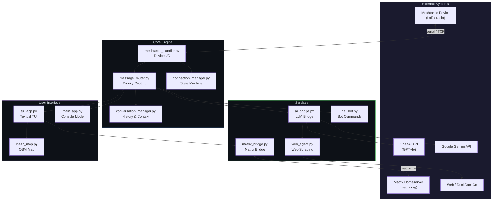

---

## Message Receive Flow

What happens when a LoRa packet arrives from the mesh network.

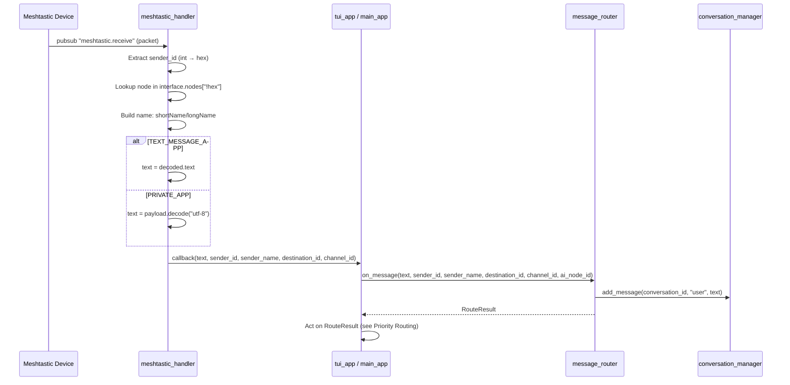

---

## Priority Routing

The `message_router.py` evaluates each incoming message against three priority levels. First match wins.

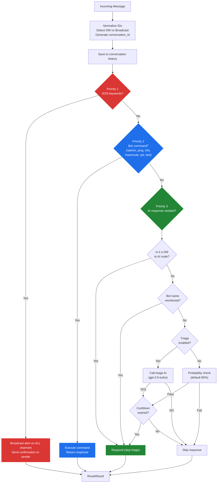

### RouteResult Fields

| Field | Type | Description |
|-------|------|-------------|
| `reply_text` | `str?` | Direct response (bot command, SOS confirmation) |
| `reply_as_dm` | `bool` | Send reply as DM instead of channel message |
| `reply_channel` | `int` | Channel index for reply |
| `reply_destination` | `str?` | Node ID for DM target |
| `broadcast_alert` | `str?` | SOS alert text to broadcast |
| `broadcast_channels` | `list[int]` | Channels for SOS broadcast |
| `conversation_id` | `str` | Conversation tracking ID |
| `needs_ai_response` | `bool` | Should AI worker be spawned? |
| `skip_triage` | `bool` | Bypass triage (DMs, direct mentions) |
| `handled` | `bool` | Fully processed (no further action needed) |

---

## AI Response Flow

When `needs_ai_response=True`, the UI spawns an `AIProcessingWorker` thread.

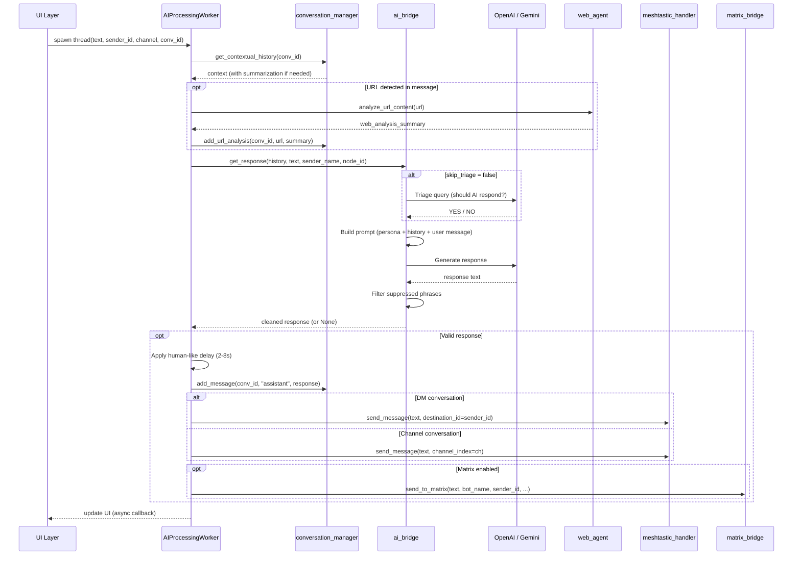

---

## AI Triage Decision

The triage system uses a lightweight LLM call to decide whether the main AI should respond to a channel message.

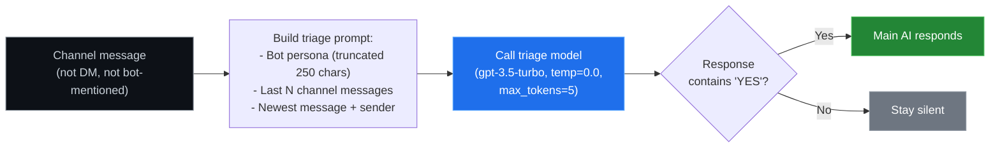

---

## Conversation Context Management

How conversation history is stored, loaded, and summarized for AI context.

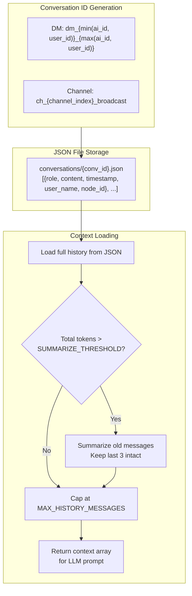

---

## SOS / Emergency Flow

Emergency messages bypass all normal routing and broadcast on every active channel.

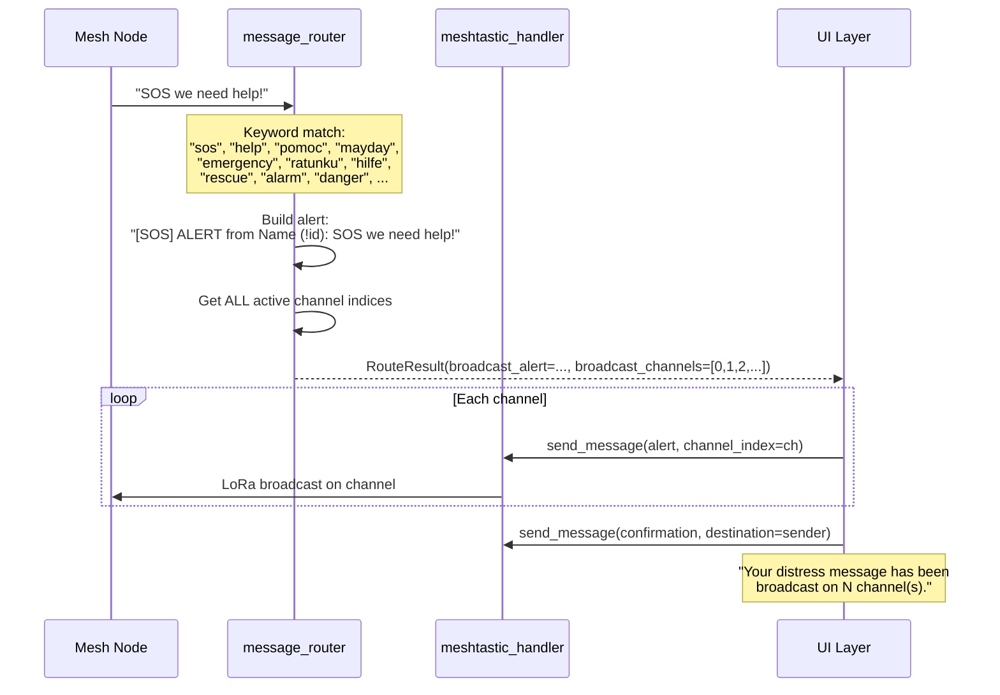

---

## Bot Command Flow

Commands handled by `hal_bot.py`. Two categories: network commands (anyone) and admin commands (authorized nodes only).

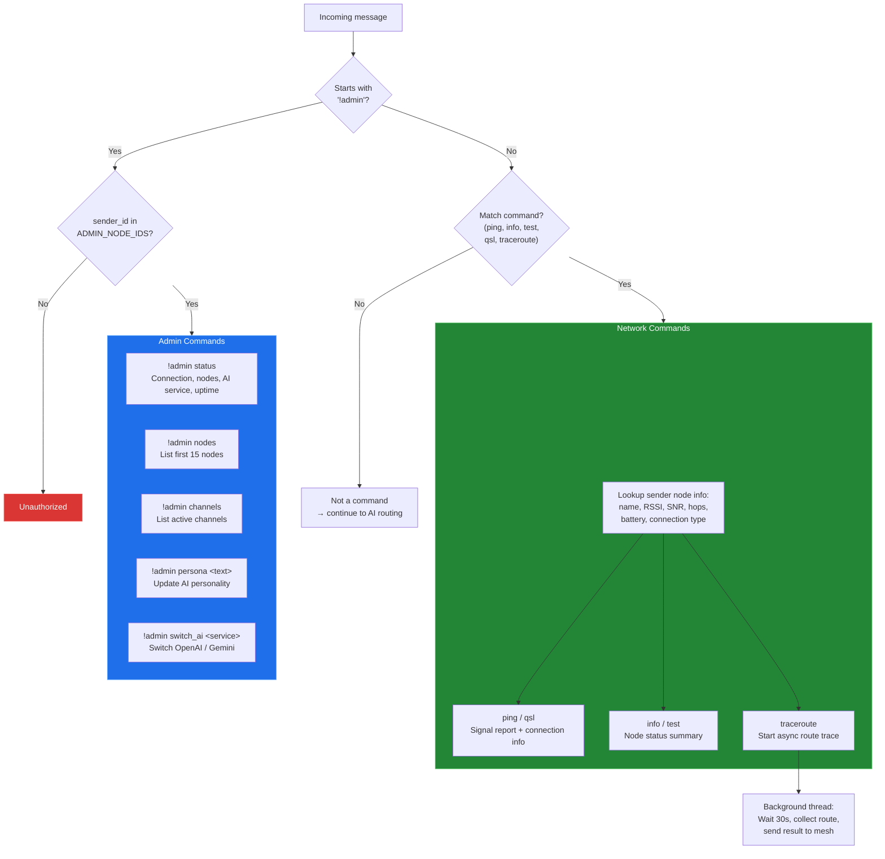

---

## Matrix Bridge Flow

Bidirectional bridge between mesh channels/DMs and Matrix rooms.

```mermaid
flowchart TD
    subgraph MeshToMatrix["Mesh → Matrix"]
        M_IN["Mesh message received"] --> M_FMT["Format:<br/>**shortName/longName** (!nodeId): text"]
        M_FMT --> M_ROOM{"Is DM?"}
        M_ROOM -->|"Yes"| M_DM["Get/create room:<br/>#mesh-dm-{nodeId}"]
        M_ROOM -->|"No"| M_CH["Get/create room:<br/>#mesh-ch{index}"]
        M_DM --> M_SEND["room_send() via matrix-nio"]
        M_CH --> M_SEND
        M_SEND --> M_INV["Auto-invite configured users"]
    end

    subgraph MatrixToMesh["Matrix → Mesh"]
        X_IN["Matrix message event"] --> X_FILTER{"Own message?<br/>Old message?"}
        X_FILTER -->|"Skip"| X_DROP["Ignore"]
        X_FILTER -->|"Process"| X_MAP["Map room → channel/node"]
        X_MAP --> X_FMT["Format:<br/>[matrixUser] text<br/>(cap 194 chars)"]
        X_FMT --> X_TYPE{"Room type?"}
        X_TYPE -->|"DM room"| X_DM["send_message(<br/>destination=nodeId)"]
        X_TYPE -->|"Channel room"| X_CH["send_message(<br/>channel_index=ch)"]
    end

    style MeshToMatrix fill:#0d1117,stroke:#58a6ff,color:#c9d1d9
    style MatrixToMesh fill:#0d1117,stroke:#3fb950,color:#c9d1d9
```

### Matrix Room Mapping

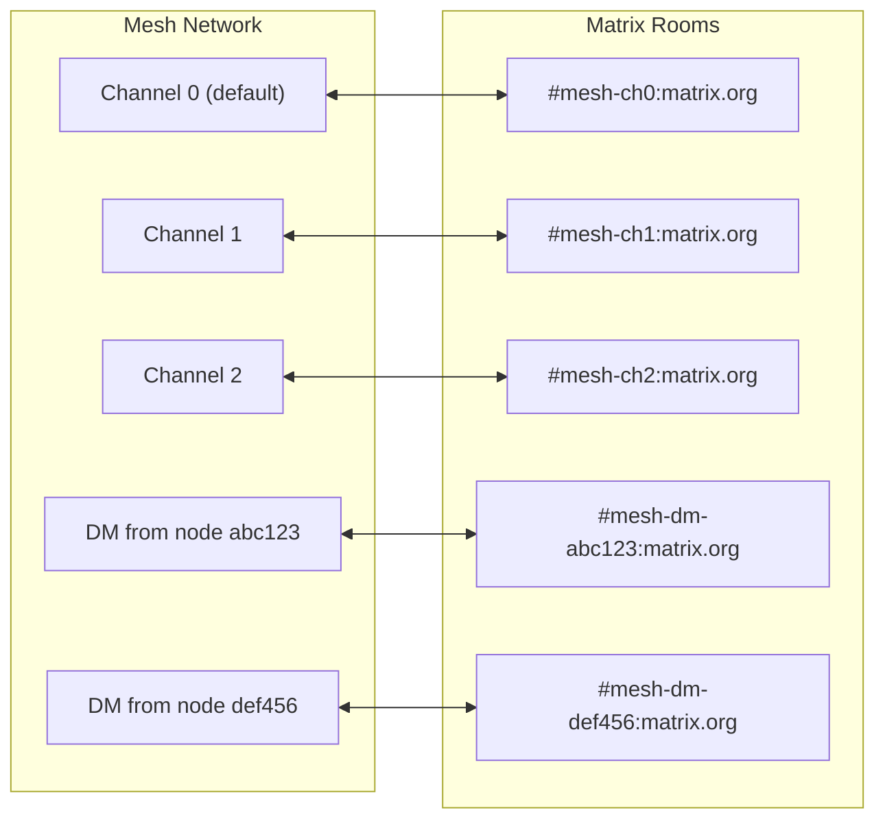

---

## Web Agent Flow

How the AI handles URLs and web queries.

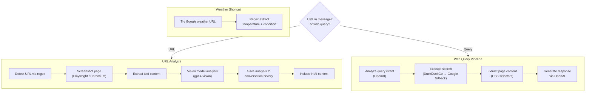

---

## Connection State Machine

Managed by `connection_manager.py`, handles reconnection with exponential backoff.

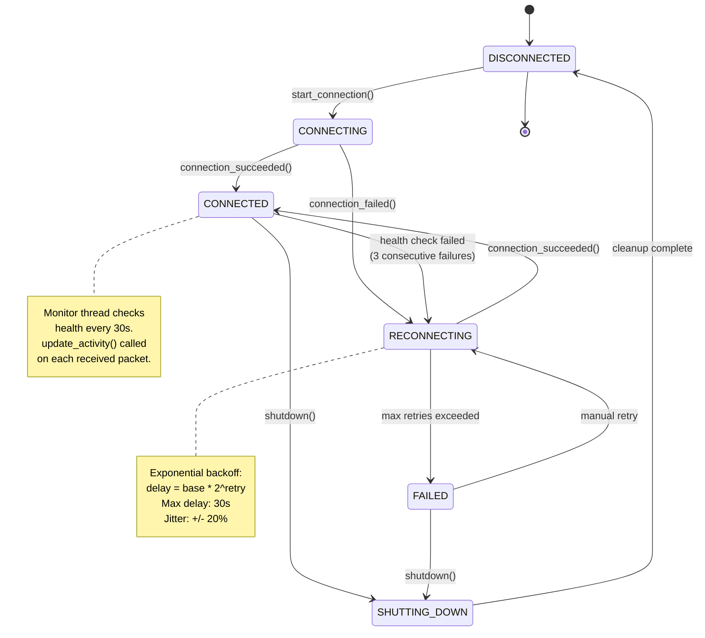

---

## Full Message Lifecycle (End-to-End)

A complete view: from LoRa radio to AI response, Matrix forwarding, and back.

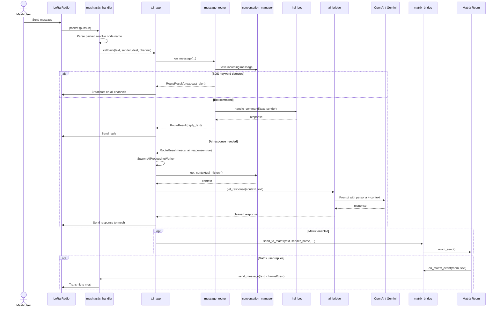

---

## Module Dependency Map

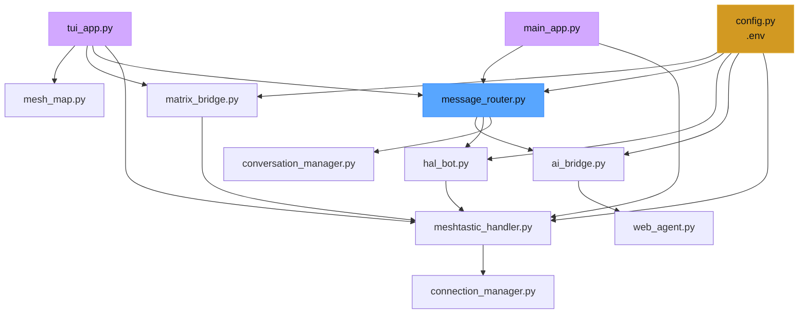

---

## Configuration Reference

| Setting | Default | Description |
|---------|---------|-------------|
| `MESHTASTIC_CONNECTION_TYPE` | `"serial"` | `"serial"` or `"tcp"` |
| `MESHTASTIC_DEVICE_SPECIFIER` | `None` | Device path or IP address |
| `DEFAULT_AI_SERVICE` | `"openai"` | `"openai"` or `"gemini"` |
| `OPENAI_MODEL_NAME` | `"gpt-4o"` | Main AI model |
| `AI_RESPONSE_PROBABILITY` | `0.85` | Chance of responding (0.0 - 1.0) |
| `AI_MIN_RESPONSE_DELAY_S` | `2` | Minimum delay before response |
| `AI_MAX_RESPONSE_DELAY_S` | `8` | Maximum delay before response |
| `AI_RESPONSE_COOLDOWN_S` | `60` | Per-conversation cooldown |
| `ENABLE_AI_TRIAGE_ON_CHANNELS` | `False` | Use triage AI for channel messages |
| `TRIAGE_AI_MODEL_NAME` | `"gpt-3.5-turbo"` | Model for triage decisions |
| `MAX_HISTORY_MESSAGES_FOR_CONTEXT` | `10` | Max messages in AI context |
| `SUMMARIZE_THRESHOLD_TOKENS` | `1000` | Token threshold for summarization |
| `MATRIX_ENABLED` | `False` | Enable Matrix bridge |
| `MATRIX_HOMESERVER` | `"https://matrix.org"` | Matrix server URL |
| `MATRIX_ROOM_PREFIX` | `"mesh"` | Prefix for room aliases |
| `MATRIX_INVITE_USERS` | `[]` | Auto-invite these Matrix users |
| `ADMIN_NODE_IDS` | `[]` | Hex node IDs for admin access |
| `BOT_NAME` | `"Eva"` | Bot display name |
